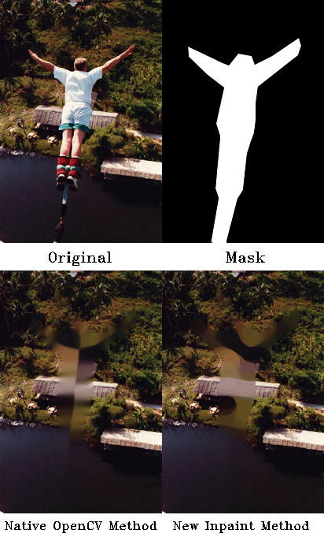

# Inpainting
OpenCV Based Inpainting

This is a moving median based function that inpaints colored images when working with opencv-python. It has multiple options for inpainting, including: using multiple different sized windows (recommended: each bigger than the previous one) that will move from the boundary of the mask towards the center and inpaint, while reversing direction each subsequent window. This in-out process smoothes the inpainted area and provides a cleaner/less grainy look. In comparission to the currently available inpainting functions in opencv-python it appears to be more verstile and provides better definition. However the time cost is expensive (seconds instead of milliseconds). This downfall can be somewhat alleviated by allowing for numba optimization (high milliseconds) which is an available kwarg. All in all, hope this finds some use. Thank you for your patronage DanKulik.

